# Infrastructure & Deployment Architecture

Complete documentation of the AI Governance Platform's infrastructure, deployment pipelines, and migration processes.

## Table of Contents

1. [Infrastructure Architecture](#infrastructure-architecture)
2. [Deployment Pipeline](#deployment-pipeline)
3. [Migration Process](#migration-process)
4. [Network Architecture](#network-architecture)
5. [Component Details](#component-details)
6. [Terraform Structure](#terraform-structure)
7. [Troubleshooting](#troubleshooting)

---

## Infrastructure Architecture

### High-Level Architecture

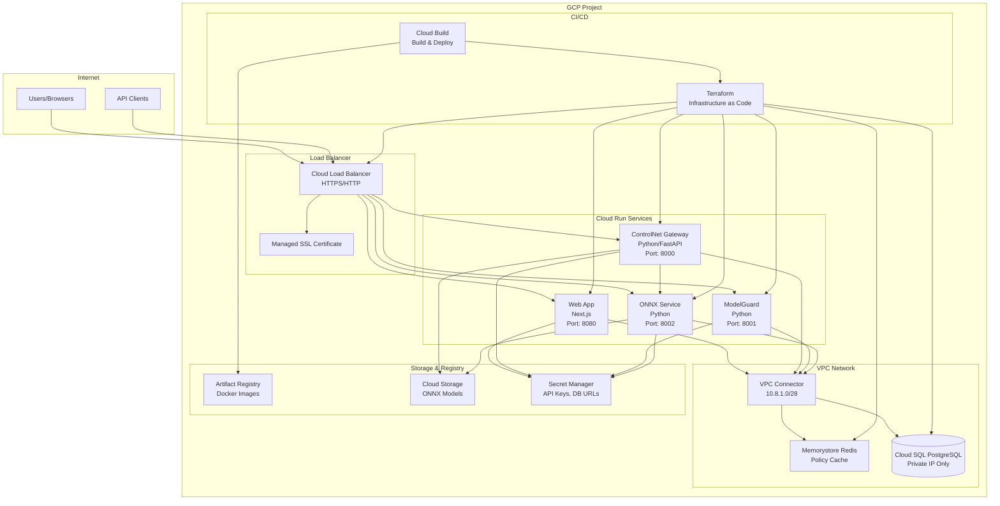
```mermaid
graph TB
    subgraph "Internet"
        Users[Users/Browsers]
        API[API Clients]
    end

    subgraph "GCP Project"
        subgraph "Load Balancer"
            LB[Cloud Load Balancer<br/>HTTPS/HTTP]
            SSL[Managed SSL Certificate]
        end

        subgraph "Cloud Run Services"
            Web[Web App<br/>Next.js<br/>Port: 8080]
            ControlNet[ControlNet Gateway<br/>Python/FastAPI<br/>Port: 8000]
            ModelGuard[ModelGuard<br/>Python<br/>Port: 8001]
            ONNX[ONNX Service<br/>Python<br/>Port: 8002]
        end

        subgraph "VPC Network"
            VPC[VPC Connector<br/>10.8.1.0/28]
            Redis[Memorystore Redis<br/>Policy Cache]
            DB[(Cloud SQL PostgreSQL<br/>Private IP Only)]
        end

        subgraph "Storage & Registry"
            AR[Artifact Registry<br/>Docker Images]
            GCS[Cloud Storage<br/>ONNX Models]
            Secrets[Secret Manager<br/>API Keys, DB URLs]
        end

        subgraph "CI/CD"
            CB[Cloud Build<br/>Build & Deploy]
            TF[Terraform<br/>Infrastructure as Code]
        end
    end

    Users --> LB
    API --> LB
    LB --> SSL
    LB --> Web
    LB --> ControlNet
    LB --> ModelGuard
    LB --> ONNX

    Web --> VPC
    ControlNet --> VPC
    ModelGuard --> VPC
    ONNX --> VPC

    VPC --> Redis
    VPC --> DB

    ControlNet --> ONNX
    ControlNet --> GCS
    ONNX --> GCS

    Web --> Secrets
    ControlNet --> Secrets
    ModelGuard --> Secrets
    ONNX --> Secrets

    CB --> AR
    CB --> TF
    TF --> Web
    TF --> ControlNet
    TF --> ModelGuard
    TF --> ONNX
    TF --> Redis
    TF --> DB
    TF --> LB
```

### Component Relationships

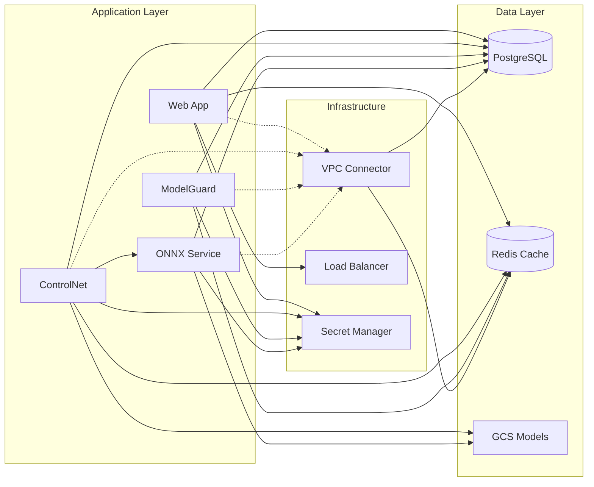
```mermaid
graph LR
    subgraph "Application Layer"
        A[Web App]
        B[ControlNet]
        C[ModelGuard]
        D[ONNX Service]
    end

    subgraph "Data Layer"
        E[(PostgreSQL)]
        F[(Redis Cache)]
        G[GCS Models]
    end

    subgraph "Infrastructure"
        H[VPC Connector]
        I[Load Balancer]
        J[Secret Manager]
    end

    A --> E
    A --> F
    A --> I
    B --> E
    B --> F
    B --> D
    B --> G
    C --> E
    C --> F
    D --> E
    D --> G

    A -.-> H
    B -.-> H
    C -.-> H
    D -.-> H

    H --> E
    H --> F

    A --> J
    B --> J
    C --> J
    D --> J
```

---

## Deployment Pipeline

### Complete Deployment Flow

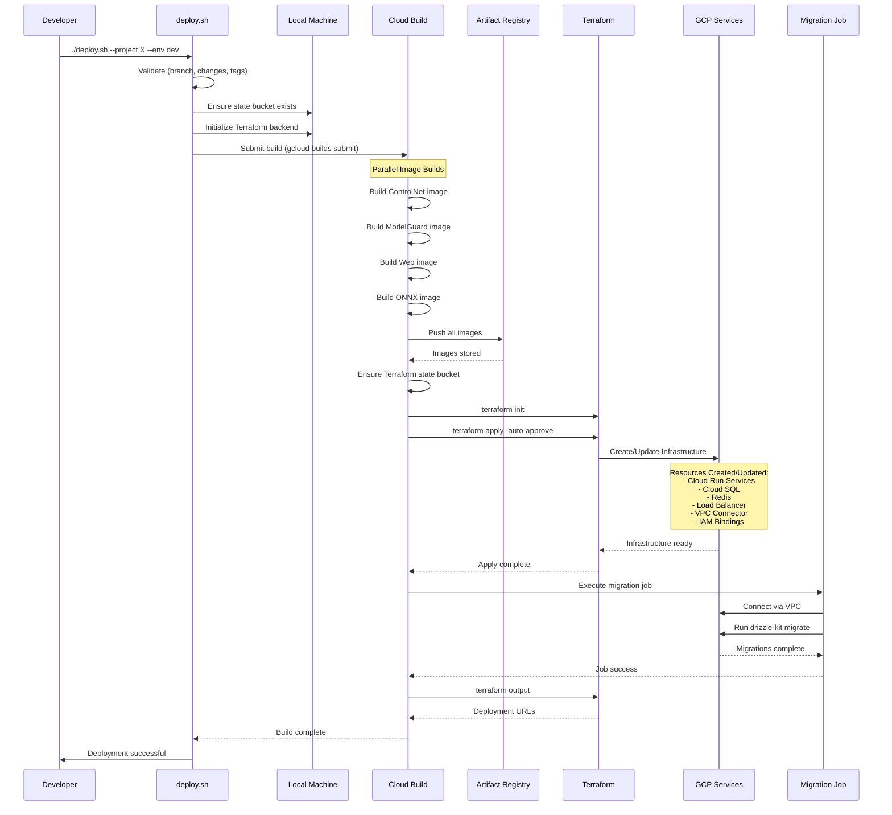
```mermaid
sequenceDiagram
    participant Dev as Developer
    participant Script as deploy.sh
    participant Local as Local Machine
    participant CB as Cloud Build
    participant AR as Artifact Registry
    participant TF as Terraform
    participant GCP as GCP Services
    participant Migrations as Migration Job

    Dev->>Script: ./deploy.sh --project X --env dev
    Script->>Script: Validate (branch, changes, tags)
    Script->>Local: Ensure state bucket exists
    Script->>Local: Initialize Terraform backend
    Script->>CB: Submit build (gcloud builds submit)
    
    Note over CB: Parallel Image Builds
    CB->>CB: Build ControlNet image
    CB->>CB: Build ModelGuard image
    CB->>CB: Build Web image
    CB->>CB: Build ONNX image
    
    CB->>AR: Push all images
    AR-->>CB: Images stored
    
    CB->>CB: Ensure Terraform state bucket
    CB->>TF: terraform init
    CB->>TF: terraform apply -auto-approve
    
    TF->>GCP: Create/Update Infrastructure
    Note over GCP: Resources Created/Updated:<br/>- Cloud Run Services<br/>- Cloud SQL<br/>- Redis<br/>- Load Balancer<br/>- VPC Connector<br/>- IAM Bindings
    
    GCP-->>TF: Infrastructure ready
    TF-->>CB: Apply complete
    
    CB->>Migrations: Execute migration job
    Migrations->>GCP: Connect via VPC
    Migrations->>GCP: Run drizzle-kit migrate
    GCP-->>Migrations: Migrations complete
    Migrations-->>CB: Job success
    
    CB->>TF: terraform output
    TF-->>CB: Deployment URLs
    CB-->>Script: Build complete
    Script->>Dev: Deployment successful
```

### Cloud Build Pipeline Steps

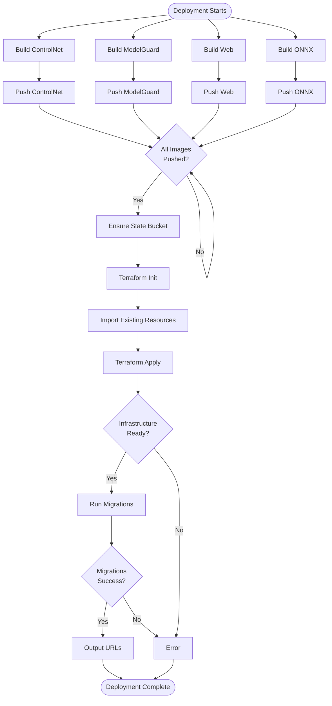
```mermaid
graph TD
    Start([Deployment Starts]) --> Build1[Build ControlNet]
    Start --> Build2[Build ModelGuard]
    Start --> Build3[Build Web]
    Start --> Build4[Build ONNX]
    
    Build1 --> Push1[Push ControlNet]
    Build2 --> Push2[Push ModelGuard]
    Build3 --> Push3[Push Web]
    Build4 --> Push4[Push ONNX]
    
    Push1 --> Wait1{All Images<br/>Pushed?}
    Push2 --> Wait1
    Push3 --> Wait1
    Push4 --> Wait1
    
    Wait1 -->|Yes| StateBucket[Ensure State Bucket]
    Wait1 -->|No| Wait1
    
    StateBucket --> TFInit[Terraform Init]
    TFInit --> TFImport[Import Existing Resources]
    TFImport --> TFApply[Terraform Apply]
    
    TFApply --> InfraReady{Infrastructure<br/>Ready?}
    InfraReady -->|Yes| Migrations[Run Migrations]
    InfraReady -->|No| Error[Error]
    
    Migrations --> MigSuccess{Migrations<br/>Success?}
    MigSuccess -->|Yes| Outputs[Output URLs]
    MigSuccess -->|No| Error
    
    Outputs --> End([Deployment Complete])
    Error --> End
```

### Deployment Script Flow

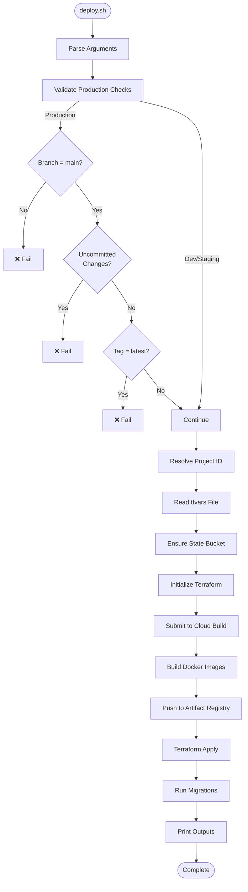
```mermaid
flowchart TD
    Start([deploy.sh]) --> Parse[Parse Arguments]
    Parse --> Validate[Validate Production Checks]
    Validate -->|Production| CheckBranch{Branch = main?}
    CheckBranch -->|No| Fail1[❌ Fail]
    CheckBranch -->|Yes| CheckChanges{Uncommitted<br/>Changes?}
    CheckChanges -->|Yes| Fail2[❌ Fail]
    CheckChanges -->|No| CheckTag{Tag = latest?}
    CheckTag -->|Yes| Fail3[❌ Fail]
    CheckTag -->|No| Continue[Continue]
    Validate -->|Dev/Staging| Continue
    
    Continue --> Resolve[Resolve Project ID]
    Resolve --> ReadVars[Read tfvars File]
    ReadVars --> EnsureBucket[Ensure State Bucket]
    EnsureBucket --> InitTF[Initialize Terraform]
    InitTF --> CloudBuild[Submit to Cloud Build]
    
    CloudBuild --> BuildImages[Build Docker Images]
    BuildImages --> PushImages[Push to Artifact Registry]
    PushImages --> ApplyTF[Terraform Apply]
    ApplyTF --> RunMigrations[Run Migrations]
    RunMigrations --> Outputs[Print Outputs]
    Outputs --> End([Complete])
```

---

## Migration Process

### Migration Architecture

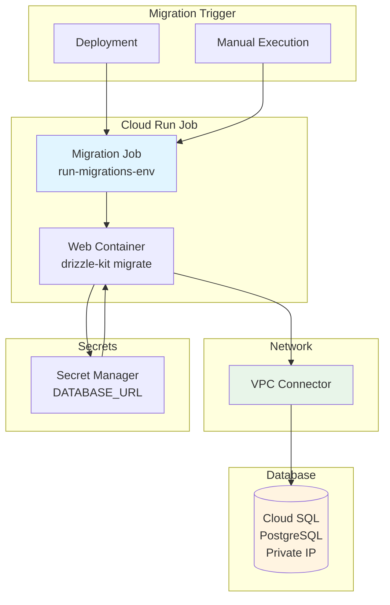
```mermaid
graph TB
    subgraph "Migration Trigger"
        Deploy[Deployment]
        Manual[Manual Execution]
    end

    subgraph "Cloud Run Job"
        Job["Migration Job<br/>run-migrations-env"]
        Container["Web Container<br/>drizzle-kit migrate"]
    end

    subgraph "Network"
        VPC[VPC Connector]
    end

    subgraph "Database"
        DB[("Cloud SQL<br/>PostgreSQL<br/>Private IP")]
    end

    subgraph "Secrets"
        SM["Secret Manager<br/>DATABASE_URL"]
    end

    Deploy --> Job
    Manual --> Job
    Job --> Container
    Container --> VPC
    Container --> SM
    VPC --> DB
    SM --> Container

    style Job fill:#e1f5ff
    style DB fill:#fff4e1
    style VPC fill:#e8f5e9
```

### Migration Execution Flow

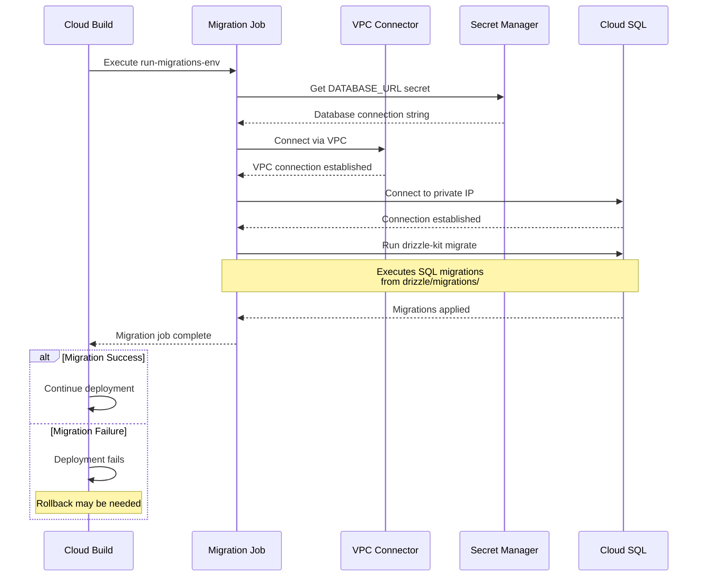
```mermaid
sequenceDiagram
    participant CB as Cloud Build
    participant Job as Migration Job
    participant VPC as VPC Connector
    participant SM as Secret Manager
    participant DB as Cloud SQL

    CB->>Job: Execute run-migrations-env
    Job->>SM: Get DATABASE_URL secret
    SM-->>Job: Database connection string
    
    Job->>VPC: Connect via VPC
    VPC-->>Job: VPC connection established
    
    Job->>DB: Connect to private IP
    DB-->>Job: Connection established
    
    Job->>DB: Run drizzle-kit migrate
    Note over Job,DB: Executes SQL migrations<br/>from drizzle/migrations/
    
    DB-->>Job: Migrations applied
    Job-->>CB: Migration job complete
    
    alt Migration Success
        CB->>CB: Continue deployment
    else Migration Failure
        CB->>CB: Deployment fails
        Note over CB: Rollback may be needed
    end
```

### Migration Job Configuration

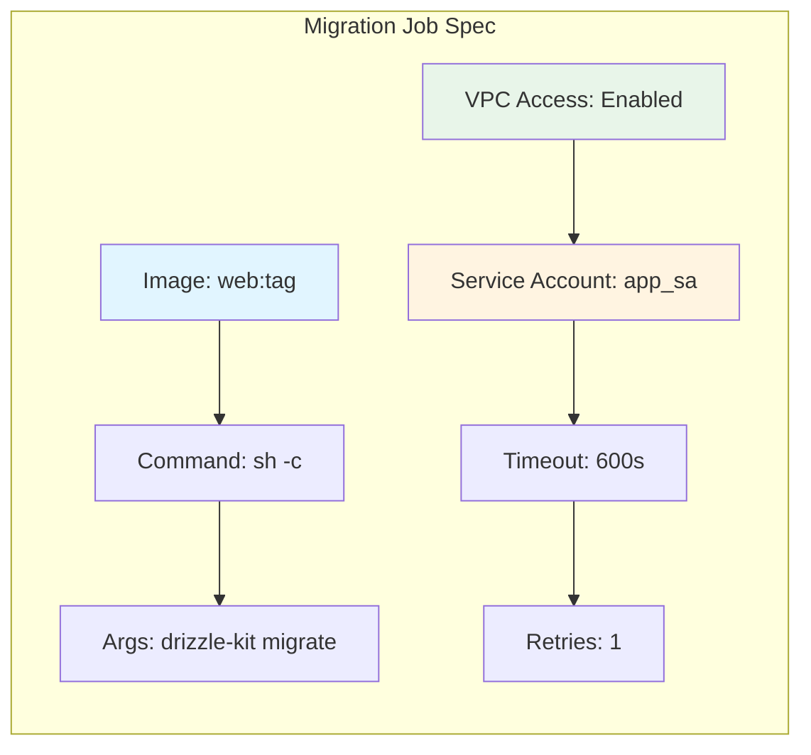
```mermaid
graph LR
    subgraph "Migration Job Spec"
        A[Image: web:tag]
        B[Command: sh -c]
        C[Args: drizzle-kit migrate]
        D[VPC Access: Enabled]
        E[Service Account: app_sa]
        F[Timeout: 600s]
        G[Retries: 1]
    end

    A --> B
    B --> C
    D --> E
    E --> F
    F --> G

    style A fill:#e1f5ff
    style D fill:#e8f5e9
    style E fill:#fff4e1
```

---

## Network Architecture

### VPC and Private Networking

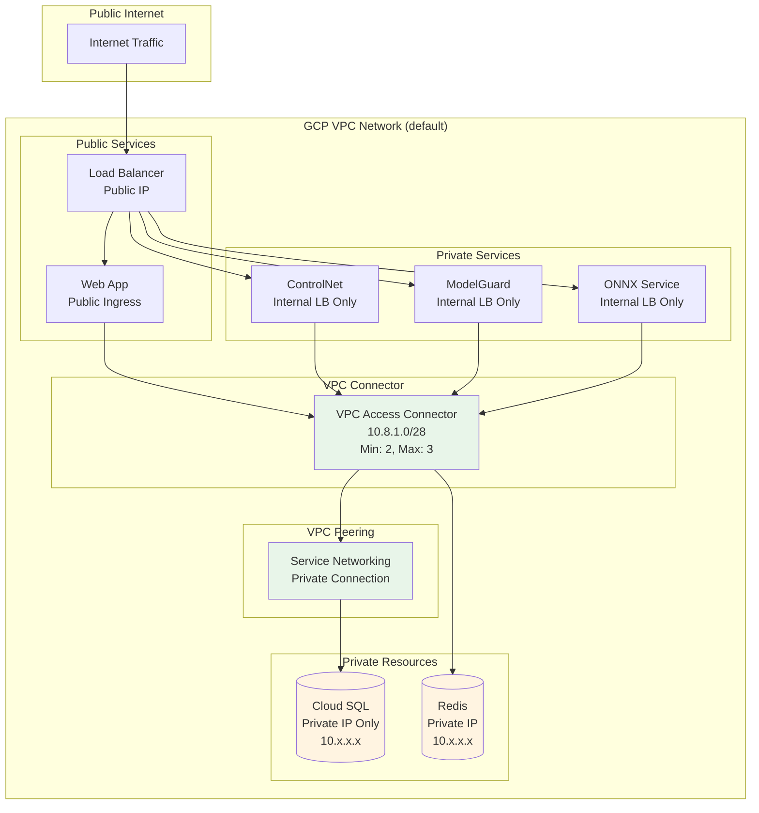
```mermaid
graph TB
    subgraph "Public Internet"
        Internet[Internet Traffic]
    end

    subgraph "GCP VPC Network (default)"
        subgraph "Public Services"
            LB[Load Balancer<br/>Public IP]
            Web[Web App<br/>Public Ingress]
        end

        subgraph "Private Services"
            ControlNet[ControlNet<br/>Internal LB Only]
            ModelGuard[ModelGuard<br/>Internal LB Only]
            ONNX[ONNX Service<br/>Internal LB Only]
        end

        subgraph "VPC Connector"
            VPC[VPC Access Connector<br/>10.8.1.0/28<br/>Min: 2, Max: 3]
        end

        subgraph "Private Resources"
            DB[(Cloud SQL<br/>Private IP Only<br/>10.x.x.x)]
            Redis[(Redis<br/>Private IP<br/>10.x.x.x)]
        end

        subgraph "VPC Peering"
            Peering[Service Networking<br/>Private Connection]
        end
    end

    Internet --> LB
    LB --> Web
    LB --> ControlNet
    LB --> ModelGuard
    LB --> ONNX

    Web --> VPC
    ControlNet --> VPC
    ModelGuard --> VPC
    ONNX --> VPC

    VPC --> Peering
    Peering --> DB
    VPC --> Redis

    style DB fill:#fff4e1
    style Redis fill:#fff4e1
    style VPC fill:#e8f5e9
    style Peering fill:#e8f5e9
```

### Load Balancer Routing

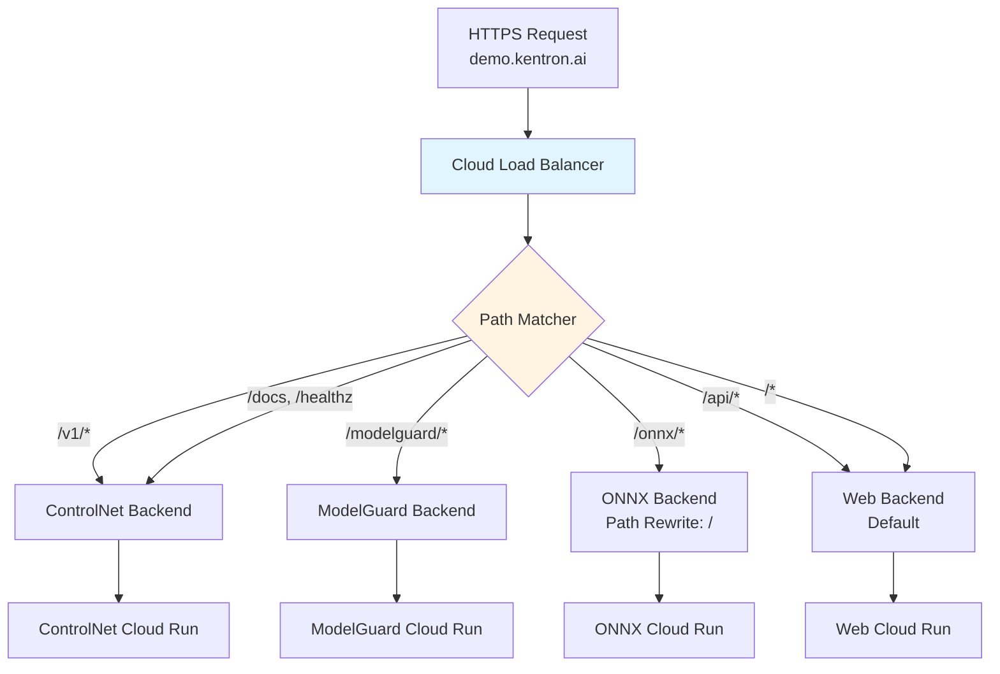
```mermaid
graph TD
    Start[HTTPS Request<br/>demo.kentron.ai] --> LB[Cloud Load Balancer]
    
    LB --> Path{Path Matcher}
    
    Path -->|/v1/*| CN[ControlNet Backend]
    Path -->|/docs, /healthz| CN
    Path -->|/modelguard/*| MG[ModelGuard Backend]
    Path -->|/onnx/*| ONNX[ONNX Backend<br/>Path Rewrite: /]
    Path -->|/api/*| Web[Web Backend]
    Path -->|/*| Web[Web Backend<br/>Default]
    
    CN --> CNRun[ControlNet Cloud Run]
    MG --> MGRun[ModelGuard Cloud Run]
    ONNX --> ONNXRun[ONNX Cloud Run]
    Web --> WebRun[Web Cloud Run]
    
    style LB fill:#e1f5ff
    style Path fill:#fff4e1
```

---

## Component Details

### Cloud Run Services


```mermaid
graph TB
    subgraph "ControlNet Gateway"
        CN1[Image: controlnet:tag]
        CN2[Port: 8000]
        CN3[CPU: 4, RAM: 8Gi]
        CN4[Min: 1, Max: 10]
        CN5[Ingress: Internal LB]
    end

    subgraph "ModelGuard"
        MG1[Image: model-guard:tag]
        MG2[Port: 8001]
        MG3[CPU: 2, RAM: 4Gi]
        MG4[Min: 0, Max: 10]
        MG5[Ingress: Internal LB]
    end

    subgraph "ONNX Service"
        ON1[Image: onnx-service:tag]
        ON2[Port: 8002]
        ON3[CPU: 8, RAM: 4Gi]
        ON4[Min: 1, Max: 10]
        ON5[Ingress: Internal LB]
    end

    subgraph "Web App"
        WB1[Image: web:tag]
        WB2[Port: 8080]
        WB3[CPU: 2, RAM: 2Gi]
        WB4[Min: 0, Max: 5]
        WB5[Ingress: All Traffic]
    end

    CN1 --> CN2
    CN2 --> CN3
    CN3 --> CN4
    CN4 --> CN5

    MG1 --> MG2
    MG2 --> MG3
    MG3 --> MG4
    MG4 --> MG5

    ON1 --> ON2
    ON2 --> ON3
    ON3 --> ON4
    ON4 --> ON5

    WB1 --> WB2
    WB2 --> WB3
    WB3 --> WB4
    WB4 --> WB5
```

### Database Architecture

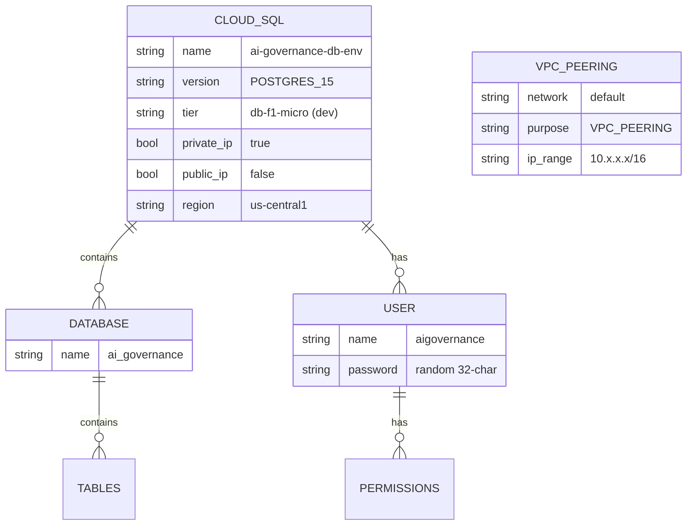
```mermaid
erDiagram
    CLOUD_SQL ||--o{ DATABASE : contains
    DATABASE ||--o{ TABLES : contains
    CLOUD_SQL ||--o{ USER : has
    USER ||--o{ PERMISSIONS : has
    
    CLOUD_SQL {
        string name "ai-governance-db-env"
        string version "POSTGRES_15"
        string tier "db-f1-micro (dev)"
        bool private_ip "true"
        bool public_ip "false"
        string region "us-central1"
    }
    
    DATABASE {
        string name "ai_governance"
    }
    
    USER {
        string name "aigovernance"
        string password "random 32-char"
    }
    
    VPC_PEERING {
        string network "default"
        string purpose "VPC_PEERING"
        string ip_range "10.x.x.x/16"
    }
```

### Secret Management

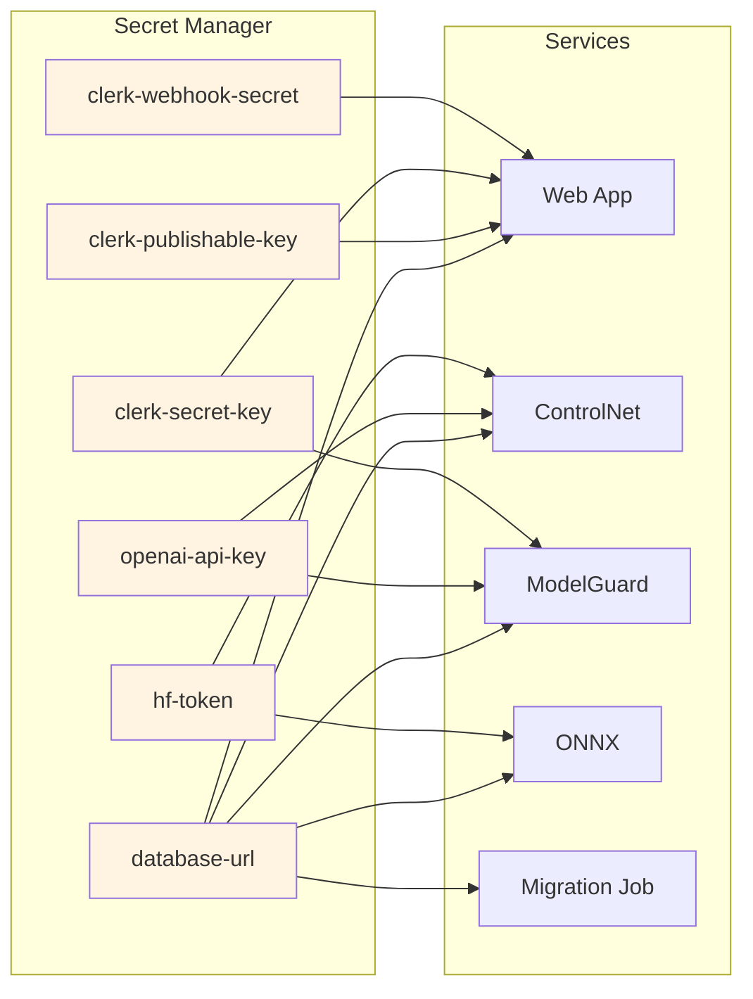
```mermaid
graph LR
    subgraph "Secret Manager"
        S1[database-url]
        S2[openai-api-key]
        S3[clerk-publishable-key]
        S4[clerk-secret-key]
        S5[clerk-webhook-secret]
        S6[hf-token]
    end

    subgraph "Services"
        A[Web App]
        B[ControlNet]
        C[ModelGuard]
        D[ONNX]
        E[Migration Job]
    end

    S1 --> A
    S1 --> B
    S1 --> C
    S1 --> D
    S1 --> E

    S2 --> B
    S2 --> C

    S3 --> A
    S4 --> A
    S4 --> C
    S5 --> A

    S6 --> B
    S6 --> D

    style S1 fill:#fff4e1
    style S2 fill:#fff4e1
    style S3 fill:#fff4e1
    style S4 fill:#fff4e1
    style S5 fill:#fff4e1
    style S6 fill:#fff4e1
```

---

## Terraform Structure

### Terraform Module Organization


```mermaid
graph TD
    Root[infra/terraform/] --> Main[main.tf<br/>Core Infrastructure]
    Root --> DB[database.tf<br/>Cloud SQL]
    Root --> LB[load_balancer.tf<br/>Load Balancer]
    Root --> Mig[migrations.tf<br/>Migration Job]
    Root --> Secrets[secrets.tf<br/>Secret References]
    Root --> Vars[variables.tf<br/>Input Variables]
    Root --> Tfvars[terraform.tfvars<br/>Environment Config]

    Main --> Services[Cloud Run Services]
    Main --> Redis[Redis Instance]
    Main --> VPC[VPC Connector]
    Main --> AR[Artifact Registry]
    Main --> GCS[GCS Buckets]
    Main --> IAM[IAM Bindings]

    DB --> SQL[PostgreSQL Instance]
    DB --> SQLUser[Database User]
    DB --> SQLSecret[DATABASE_URL Secret]

    LB --> LBIp[Static IP]
    LB --> Backends[Backend Services]
    LB --> URLMap[URL Map]
    LB --> SSL[SSL Certificate]

    style Root fill:#e1f5ff
    style Main fill:#e8f5e9
    style DB fill:#fff4e1
    style LB fill:#fff4e1
```

### Terraform Resource Dependencies

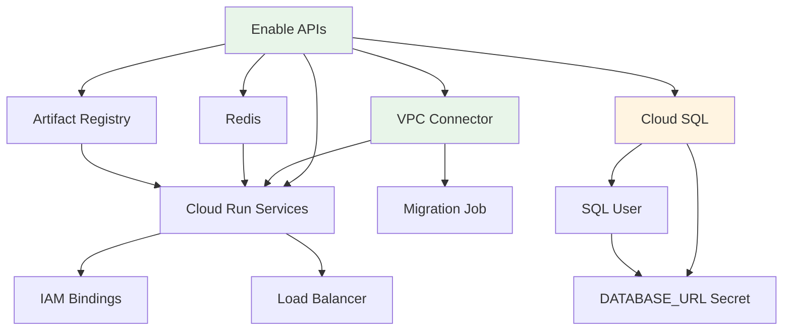
```mermaid
graph TD
    APIs[Enable APIs] --> AR[Artifact Registry]
    APIs --> VPC[VPC Connector]
    APIs --> Redis[Redis]
    APIs --> Services[Cloud Run Services]
    APIs --> DB[Cloud SQL]

    VPC --> Services
    VPC --> Migrations[Migration Job]

    Redis --> Services

    DB --> SQLUser[SQL User]
    DB --> SQLSecret[DATABASE_URL Secret]
    SQLUser --> SQLSecret

    Services --> IAM[IAM Bindings]
    Services --> LB[Load Balancer]

    AR --> Services

    style APIs fill:#e8f5e9
    style VPC fill:#e8f5e9
    style DB fill:#fff4e1
```

### Terraform State Management

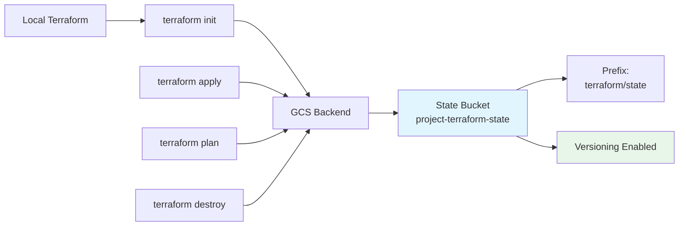
```mermaid
graph LR
    Local[Local Terraform] --> Init[terraform init]
    Init --> Backend[GCS Backend]
    Backend --> Bucket["State Bucket<br/>project-terraform-state"]
    Bucket --> Prefix["Prefix:<br/>terraform/state"]
    
    Apply[terraform apply] --> Backend
    Plan[terraform plan] --> Backend
    Destroy[terraform destroy] --> Backend
    
    Bucket --> Versioning[Versioning Enabled]
    
    style Bucket fill:#e1f5ff
    style Versioning fill:#e8f5e9
```

---

## Deployment Scenarios

### Full Deployment (with Image Builds)

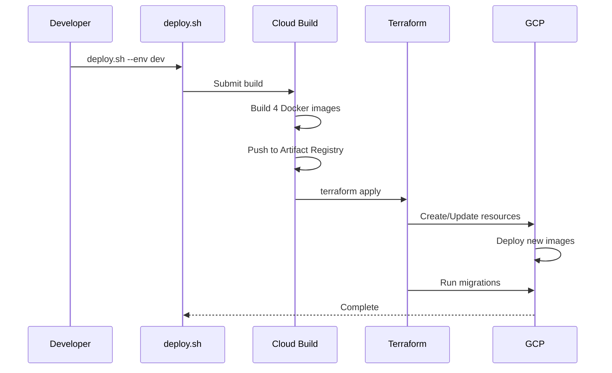
```mermaid
sequenceDiagram
    participant Dev as Developer
    participant Script as deploy.sh
    participant CB as Cloud Build
    participant TF as Terraform
    participant GCP as GCP

    Dev->>Script: deploy.sh --env dev
    Script->>CB: Submit build
    CB->>CB: Build 4 Docker images
    CB->>CB: Push to Artifact Registry
    CB->>TF: terraform apply
    TF->>GCP: Create/Update resources
    GCP->>GCP: Deploy new images
    TF->>GCP: Run migrations
    GCP-->>Script: Complete
```

### Quick Terraform Apply (No Builds)

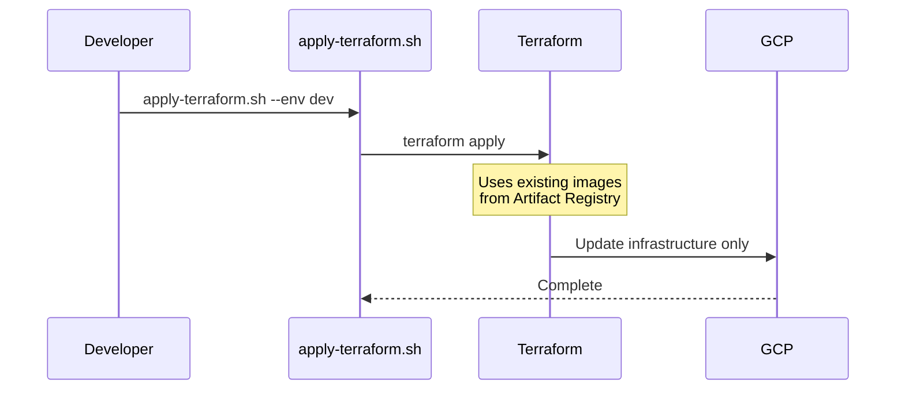
```mermaid
sequenceDiagram
    participant Dev as Developer
    participant Script as apply-terraform.sh
    participant TF as Terraform
    participant GCP as GCP

    Dev->>Script: apply-terraform.sh --env dev
    Script->>TF: terraform apply
    Note over TF: Uses existing images<br/>from Artifact Registry
    TF->>GCP: Update infrastructure only
    GCP-->>Script: Complete
```

---

## Data Flow

### Request Flow Through System

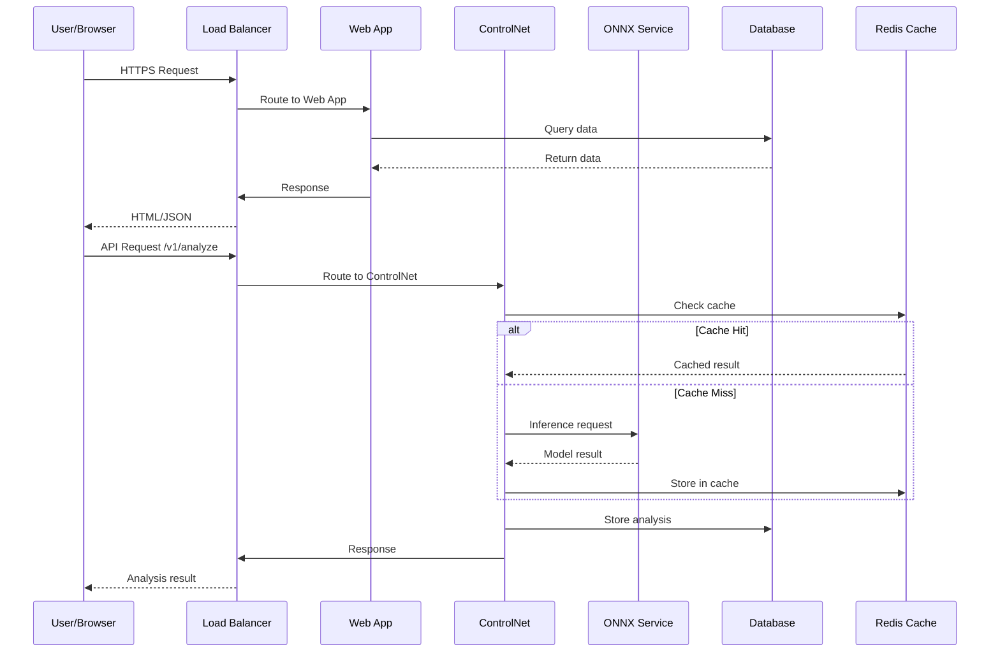
```mermaid
sequenceDiagram
    participant User as User/Browser
    participant LB as Load Balancer
    participant Web as Web App
    participant CN as ControlNet
    participant ONNX as ONNX Service
    participant DB as Database
    participant Redis as Redis Cache

    User->>LB: HTTPS Request
    LB->>Web: Route to Web App
    Web->>DB: Query data
    DB-->>Web: Return data
    Web->>LB: Response
    LB-->>User: HTML/JSON

    User->>LB: API Request /v1/analyze
    LB->>CN: Route to ControlNet
    CN->>Redis: Check cache
    alt Cache Hit
        Redis-->>CN: Cached result
    else Cache Miss
        CN->>ONNX: Inference request
        ONNX-->>CN: Model result
        CN->>Redis: Store in cache
    end
    CN->>DB: Store analysis
    CN->>LB: Response
    LB-->>User: Analysis result
```

### Database Connection Flow

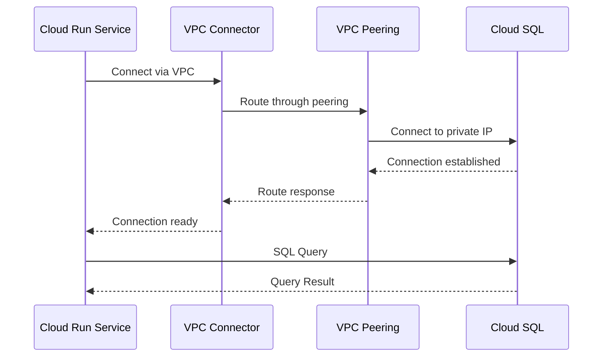
```mermaid
sequenceDiagram
    participant Service as Cloud Run Service
    participant VPC as VPC Connector
    participant Peering as VPC Peering
    participant DB as Cloud SQL

    Service->>VPC: Connect via VPC
    VPC->>Peering: Route through peering
    Peering->>DB: Connect to private IP
    DB-->>Peering: Connection established
    Peering-->>VPC: Route response
    VPC-->>Service: Connection ready
    
    Service->>DB: SQL Query
    DB-->>Service: Query Result
```

---

## Troubleshooting

### Common Issues and Solutions

#### 1. Terraform State Bucket Not Found

```mermaid
graph TD
    Error[Error: bucket doesn't exist] --> Check[Check if bucket exists]
    Check -->|Exists| Perms[Check permissions]
    Check -->|Not Exists| Create[Create bucket]
    Create --> Enable[Enable versioning]
    Perms -->|No Access| Grant[Grant Storage Admin]
    Perms -->|Has Access| Init[Re-run terraform init]
    Enable --> Init
    Grant --> Init
```

#### 2. Migration Job Failures

```mermaid
graph TD
    Fail[Migration Fails] --> CheckVPC{VPC Access?}
    CheckVPC -->|No| FixVPC[Ensure VPC connector exists]
    CheckVPC -->|Yes| CheckSecret{Secret Exists?}
    CheckSecret -->|No| CreateSecret[Create DATABASE_URL secret]
    CheckSecret -->|Yes| CheckDB{DB Accessible?}
    CheckDB -->|No| CheckPeering[Verify VPC peering]
    CheckDB -->|Yes| CheckMigrations{Migration Files?}
    CheckMigrations -->|No| AddMigrations[Add migration files]
    CheckMigrations -->|Yes| Retry[Retry migration job]
    
    FixVPC --> Retry
    CreateSecret --> Retry
    CheckPeering --> Retry
    AddMigrations --> Retry
```

#### 3. Image Build Failures

```mermaid
graph TD
    BuildFail[Build Fails] --> CheckDockerfile{Dockerfile Valid?}
    CheckDockerfile -->|No| FixDockerfile[Fix Dockerfile]
    CheckDockerfile -->|Yes| CheckSecrets{Secrets Available?}
    CheckSecrets -->|No| CreateSecrets[Create missing secrets]
    CheckSecrets -->|Yes| CheckAPIs{APIs Enabled?}
    CheckAPIs -->|No| EnableAPIs[Enable required APIs]
    CheckAPIs -->|Yes| CheckQuota{Quota Available?}
    CheckQuota -->|No| RequestQuota[Request quota increase]
    CheckQuota -->|Yes| RetryBuild[Retry build]
    
    FixDockerfile --> RetryBuild
    CreateSecrets --> RetryBuild
    EnableAPIs --> RetryBuild
    RequestQuota --> RetryBuild
```

---

## Environment Configuration

### Environment Variables

Each environment (dev, staging, prod) has its own configuration:

```mermaid
graph LR
    subgraph "Development"
        D1[Small DB: db-f1-micro]
        D2[Redis: BASIC, 1GB]
        D3[Min Instances: 0-1]
    end

    subgraph "Staging"
        S1[Medium DB: db-custom-2-8192]
        S2[Redis: STANDARD_HA, 2GB]
        S3[Min Instances: 1]
    end

    subgraph "Production"
        P1[Large DB: db-custom-4-16384]
        P2[Redis: STANDARD_HA, 4GB]
        P3[Min Instances: 1+]
    end

    style D1 fill:#e8f5e9
    style S1 fill:#fff4e1
    style P1 fill:#ffebee
```

### Configuration Files

- `terraform.tfvars` - Development environment (environment = "dev")
- `terraform.tfvars.staging` - Staging environment (environment = "staging")
- `terraform.tfvars.production` - Production environment (environment = "prod")

Each file contains:
- Project ID
- Region
- Domain
- Database tier
- Redis configuration
- Scaling parameters

---

## Security Architecture

### IAM and Access Control

```mermaid
graph TB
    subgraph "Service Accounts"
        AppSA["app_sa<br/>ai-governance-env"]
        CBSA[Cloud Build SA]
    end

    subgraph "IAM Roles"
        R1[roles/cloudsql.client]
        R2[roles/secretmanager.secretAccessor]
        R3[roles/redis.editor]
        R4[roles/storage.objectViewer]
        R5[roles/run.admin]
    end

    subgraph "Resources"
        DB[(Cloud SQL)]
        SM[Secret Manager]
        Redis[(Redis)]
        GCS[GCS Buckets]
        CR[Cloud Run]
    end

    AppSA --> R1
    AppSA --> R2
    AppSA --> R3
    AppSA --> R4

    CBSA --> R5

    R1 --> DB
    R2 --> SM
    R3 --> Redis
    R4 --> GCS
    R5 --> CR

    style AppSA fill:#e1f5ff
    style CBSA fill:#fff4e1
```

### Network Security

- **Private Database**: Cloud SQL has no public IP, only accessible via VPC
- **Internal Services**: ControlNet, ModelGuard, ONNX only accept traffic from Load Balancer
- **Public Web**: Web app accepts all traffic (needed for Clerk auth flows)
- **VPC Isolation**: All private resources isolated in VPC network

---

## Cost Optimization

### Resource Sizing by Environment

| Component | Dev | Staging | Production |
|-----------|-----|---------|------------|
| Cloud SQL | db-f1-micro | db-custom-2-8192 | db-custom-4-16384 |
| Redis | BASIC, 1GB | STANDARD_HA, 2GB | STANDARD_HA, 4GB |
| ControlNet Min | 1 | 1 | 1 |
| ControlNet Max | 10 | 20 | 50 |
| Web Min | 0 | 0 | 1 |
| Web Max | 5 | 10 | 20 |
| VPC Connector | 2-3 instances | 2-3 instances | 2-3 instances |

### Auto-scaling

All Cloud Run services support auto-scaling:
- Scale to zero when idle (except ControlNet/ONNX with min instances)
- Scale up based on request volume
- CPU and memory limits prevent runaway costs

---

## Monitoring and Observability

### Key Metrics to Monitor

1. **Cloud Run Services**
   - Request latency (p50, p95, p99)
   - Error rate
   - Instance count
   - CPU/Memory utilization

2. **Database**
   - Connection count
   - Query performance
   - Disk usage
   - Backup status

3. **Redis**
   - Memory usage
   - Hit rate
   - Connection count

4. **Load Balancer**
   - Request volume
   - Error rate
   - SSL certificate status

---

## Best Practices

### Deployment

1. ✅ Always use versioned tags for production
2. ✅ Deploy from `main` branch only for production
3. ✅ Test in dev/staging first
4. ✅ Monitor deployments for errors
5. ✅ Keep Terraform state bucket versioning enabled

### Infrastructure

1. ✅ Use private IPs for databases
2. ✅ Enable automated backups
3. ✅ Use Secret Manager for sensitive data
4. ✅ Enable VPC connector for private resources
5. ✅ Use appropriate resource sizing per environment

### Security

1. ✅ Least privilege IAM roles
2. ✅ Private database connections
3. ✅ SSL/TLS for all external traffic
4. ✅ Regular secret rotation
5. ✅ Enable deletion protection for production databases

---

## Quick Reference

### Common Commands

```bash
# Full deployment
./infra/scripts/deploy.sh --project kn-dev-01 --env dev --image-tag latest

# Terraform only (no builds)
./infra/scripts/apply-terraform.sh --project kn-dev-01 --env dev

# Run migrations manually
gcloud run jobs execute run-migrations-dev --region=us-central1 --project=kn-dev-01

# Check Terraform state
cd infra/terraform
terraform state list

# View outputs
terraform output
```

### Key Files

- `infra/scripts/deploy.sh` - Main deployment script
- `infra/cloudbuild.yaml` - Cloud Build configuration
- `infra/terraform/main.tf` - Core infrastructure
- `infra/terraform/database.tf` - Database configuration
- `infra/terraform/load_balancer.tf` - Load balancer setup
- `infra/terraform/migrations.tf` - Migration job

---

## Conclusion

This infrastructure provides:

- ✅ **Scalability**: Auto-scaling Cloud Run services
- ✅ **Security**: Private databases, VPC isolation, IAM controls
- ✅ **Reliability**: Managed services, automated backups, health checks
- ✅ **Cost Efficiency**: Right-sized resources per environment
- ✅ **Maintainability**: Infrastructure as Code with Terraform
- ✅ **Observability**: Cloud Logging, monitoring, and health checks

For questions or issues, refer to the troubleshooting section or check the individual component documentation.

